---
title: "CMU 16-825 - Assignment 1: Rendering basics with PyTorch3D"
author: ["Hoang-Phuc Nguyen"]
date: 2025-11-30
summary: "In this assignment, you will learn the basics of rendering with PyTorch3D, explore 3D representations, and practice constructing simple geometry."
description: "In this assignment, you will learn the basics of rendering with PyTorch3D, explore 3D representations, and practice constructing simple geometry."
tags: ["PyTorch3D", "Rendering", "3D", "Computer Vision", "Assignments", "CMU 16-825", "CMU"]
series: ["CMU 16-825"]
draft: false
--- 

# 1. Practicing with Cameras (15 Points)


```python {linenos=true}
import pytorch3d as p3d
import numpy as np
from tqdm import tqdm
import imageio
from starter.utils import get_mesh_renderer, get_device

def camera360(mesh, img_size=256, num_frames=36, duration=1000, distance=3.0, elevation=15.0, output_path=None, device=None):
    renderer = get_mesh_renderer(img_size)

    if device is None:
        device = get_device()

    mesh = mesh.to(device)

    duration //= num_frames  # duration per frame in milliseconds
    degrees = np.linspace(0, 360, num=num_frames).tolist()
    my_images = []

    # lights = p3d.renderer.PointLights(location=[[0.0, 0.0, -3.0]])

    for angle in tqdm(degrees):
        R, T = p3d.renderer.cameras.look_at_view_transform(distance, elevation, angle)
        cameras = p3d.renderer.FoVPerspectiveCameras(R=R, T=T, fov=60.0, device=device)
        lights = p3d.renderer.PointLights(location=cameras.get_camera_center(), device=device)
        rend = renderer(mesh, cameras=cameras, lights=lights)
        image = rend[0, ..., :3].cpu().numpy()
        my_images.append((image * 255).astype(np.uint8))

    if output_path is not None:
        imageio.mimsave(output_path, my_images, duration=duration, loop=0)
        return None
    else:
        return my_images
```

## 1.1. 360-degree Renders (5 points)


```python {linenos=true}
from pytorch3d.io import load_objs_as_meshes

cow_mesh = load_objs_as_meshes(["data/cow.obj"])
camera360(cow_mesh, output_path="output/cow-360.gif")
```

    100%|██████████| 36/36 [00:01<00:00, 19.27it/s]


Result:

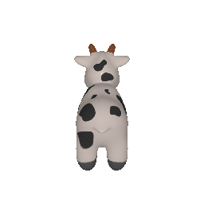

## 1.2 Re-creating the Dolly Zoom (10 points)

### Dolly (zoom-with-compensation) main formula

Given a vertical field of view $\mathrm{fov}$ (in degrees), the camera distance is set to

$$
d(\mathrm{fov}) = \frac{2}{\tan\left(\frac{\mathrm{fov}}{2}\right)}
$$

```python {linenos=true}
for fov in tqdm(fovs):
    distance = 1/np.tan(fov/2 * np.pi / 180) * 2
    T = [[0, 0, distance]]
    ...
```


```python {linenos=true}
# python -m starter.dolly_zoom --duration 30 --num_frames 100
```

Result:

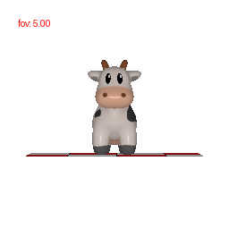

# 2. Practicing with Meshes (10 Points)

## 2.1 Constructing a Tetrahedron (5 points)


```python {linenos=true}
import pytorch3d as p3d
import torch

points = torch.tensor([[
    [0.0, 0.0, -1.0],
    [0.0, 0.0, 1.0],
    [1.0, 1.0, 1.0],
    [1.0, -1.0, 1.0],
]])
faces = torch.tensor([[
    [0, 1, 2],
    [0, 1, 3],
    [1, 2, 3],
    [0, 2, 3],
]])
textures = torch.tensor([[
    [1.0, 0.0, 0.0],
    [0.0, 1.0, 0.0],
    [0.0, 0.0, 1.0],
    [1.0, 0.0, 1.0],
]])
textures = textures[:, :, None, None, :]

tetrahedron = p3d.structures.Meshes(
    verts=points,
    faces=faces,
    textures=p3d.renderer.TexturesAtlas(textures)
)

camera360(tetrahedron, num_frames=100, duration=2000, output_path="output/tetrahedron.gif")
```

    100%|██████████| 100/100 [00:00<00:00, 156.75it/s]


Result:

- Number of vertices: 4
- Number of faces: 4

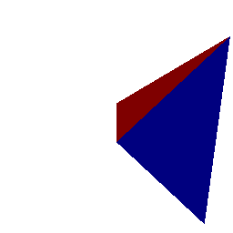

## 2.2 Constructing a Cube (5 points)


```python {linenos=true}
import pytorch3d as p3d
import torch

points = torch.tensor([[
    [-1.0, -1.0, -1.0],
    [-1.0, -1.0, 1.0],
    [-1.0, 1.0, -1.0],
    [-1.0, 1.0, 1.0],
    [1.0, -1.0, -1.0],
    [1.0, -1.0, 1.0],
    [1.0, 1.0, -1.0],
    [1.0, 1.0, 1.0],
]])
faces = torch.tensor([[
    [0, 4, 5],
    [0, 5, 1],
    [4, 6, 7],
    [4, 7, 5],
    [6, 2, 3],
    [6, 3, 7],
    [2, 0, 1],
    [2, 1, 3],
    [1, 5, 7],
    [1, 7, 3],
    [2, 6, 4],
    [2, 4, 0],
]])
textures = torch.tensor([[
    [1.0, 0.0, 0.0],
    [1.0, 0.0, 0.0],
    [0.0, 1.0, 0.0],
    [0.0, 1.0, 0.0],
    [0.0, 0.0, 1.0],
    [0.0, 0.0, 1.0],
    [1.0, 0.0, 1.0],
    [1.0, 0.0, 1.0],
    [1.0, 1.0, 0.0],
    [1.0, 1.0, 0.0],
    [0.0, 1.0, 1.0],
    [0.0, 1.0, 1.0],
]])
textures = textures[:, :, None, None, :]

cube = p3d.structures.Meshes(
    verts=points,
    faces=faces,
    textures=p3d.renderer.TexturesAtlas(textures)
)

camera360(cube, num_frames=100, duration=2000, distance=5, elevation=30, output_path="output/cube.gif")
```

    100%|██████████| 100/100 [00:00<00:00, 159.00it/s]


Result:

- Number of vertices: 8
- Number of triangle faces: 12

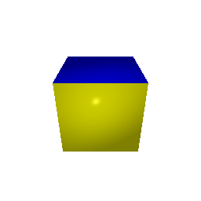

# 3. Re-texturing a mesh (10 points)


```python {linenos=true}
import pytorch3d as p3d
import torch
from starter.utils import load_cow_mesh

vertices, faces = load_cow_mesh('data/cow.obj')

def color_interpolate(color1, color2, alpha):
    return alpha * color2 + (1 - alpha) * color1

z_min = vertices[:, 2].min()
z_max = vertices[:, 2].max()

color1 = torch.tensor([0.0, 0.0, 1.0])  # Blue color
color2 = torch.tensor([1.0, 0.0, 0.0])  # Red color

alphas = (vertices[:, 2] - z_min) / (z_max - z_min)

textures = color_interpolate(color1[None, ...], color2[None, ...], alphas[..., None]).unsqueeze(0)
vertices = vertices.unsqueeze(0)
faces = faces.unsqueeze(0)

cow_mesh = p3d.structures.Meshes(
    verts=vertices,
    faces=faces,
    textures=p3d.renderer.TexturesVertex(textures)
)

camera360(cow_mesh, output_path="output/cow-retexture.gif")
```

    100%|██████████| 36/36 [00:00<00:00, 156.98it/s]


Result:

- Color 1: Blue
- Color 2: Red

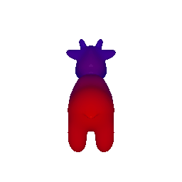

# 4. Camera Transformations (10 points)


```python {linenos=true}
import pytorch3d as p3d
import numpy as np
from starter.camera_transforms import render_textured_cow
import matplotlib.pyplot as plt

R_relative = [
    [[1.0, 0.0, 0.0],
     [0.0, 1.0, 0.0],
     [0.0, 0.0, 1.0]],
    [[0.0, 1.0, 0.0],
     [-1.0, 0.0, 0.0],
     [0.0, 0.0, 1.0]],
    [[1.0, 0.0, 0.0],
     [0.0, 1.0, 0.0],
     [0.0, 0.0, 1.0]],
    [[1.0, 0.0, 0.0],
     [0.0, 1.0, 0.0],
     [0.0, 0.0, 1.0]],
    [[0.0, 0.0, 1.0],
     [0.0, 1.0, 0.0],
     [-1.0, 0.0, 0.0]],
]
T_relative = [
    [0.0, 0.0, 0.0],
    [0.0, 0.0, 0.0],
    [0.0, 0.0, 3.0],
    [0.5, -0.5, 0.0],
    [-3.0, 0.0, 3.0],
]

plt.ioff()
for i in range(len(R_relative)):
    image = render_textured_cow(cow_path="data/cow.obj", R_relative=R_relative[i], T_relative=T_relative[i])
    plt.imshow(image)
    plt.axis('off')
    plt.imsave(f"output/cow_view_{i}.png", image)
plt.ion()
```

R_relative and T_relative are another affine transformation pair that defines the camera's pose relative to the cow model.

The formula to compute the new camera extrinsics is:

R_relative and T_relative are another affine transformation pair that defines the camera's pose relative to the cow model.

The formula to compute the new camera extrinsics is:

$$
R_{\text{new}} = R_{\text{relative}}\,R_{\text{cow}} \\
T_{\text{new}} = R_{\text{relative}}\,T_{\text{cow}} + T_{\text{relative}}
$$

The points will be transformed from world coordinates to camera coordinates using the new extrinsics.

$$
P_{\text{camera}} = R_{\text{relative}} \cdot (R_{\text{cow}} \cdot P_{\text{world}} + T_{\text{cow}}) + T_{\text{relative}}
$$

Results:

<div style="display:flex;flex-wrap:wrap;gap:8px;align-items:center;">
    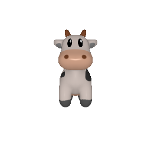
    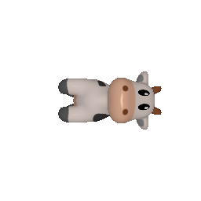
    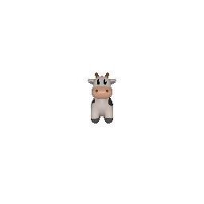
    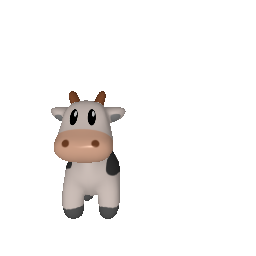
    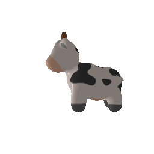
</div>

# 5. Rendering Generic 3D Representations (45 Points)


```python {linenos=true}
import pytorch3d as p3d
from starter.utils import get_points_renderer, get_device
from tqdm import tqdm
import numpy as np
import imageio

def camera_point_360(point_cloud, img_size=256, num_frames=36, duration=1000, distance=3.0, elevation=15.0, output_path=None, device=None):
    points_renderer = get_points_renderer(
        image_size=img_size,
        radius=0.01,
    )

    if device is None:
        device = get_device()

    point_cloud = point_cloud.to(device)

    duration //= num_frames  # duration per frame in milliseconds
    degrees = np.linspace(0, 360, num=num_frames).tolist()
    my_images = []

    for angle in tqdm(degrees):
        R, T = p3d.renderer.cameras.look_at_view_transform(distance, elevation, angle)
        cameras = p3d.renderer.FoVPerspectiveCameras(R=R, T=T, fov=60.0, device=device)
        rend = points_renderer(point_cloud, cameras=cameras, device=device)
        image = rend[0, ..., :3].cpu().numpy()  # (B, H, W, 4) -> (H, W, 3).
        # image = np.flipud(image)
        my_images.append((image * 255).astype(np.uint8))

    if output_path is not None:
        imageio.mimsave(output_path, my_images, duration=duration, loop=0)
        return None
    else:
        return my_images
```

## 5.1 Rendering Point Clouds from RGB-D Images (10 points)


```python {linenos=true}
import torch
import pytorch3d as p3d
from starter.render_generic import load_rgbd_data
from starter.utils import unproject_depth_image

data = load_rgbd_data()

points1, rgba1 = unproject_depth_image(
    torch.tensor(data['rgb1']),
    torch.tensor(data['mask1']),
    torch.tensor(data['depth1']),
    data['cameras1'],
)
points2, rgba2 = unproject_depth_image(
    torch.tensor(data['rgb2']),
    torch.tensor(data['mask2']),
    torch.tensor(data['depth2']),
    data['cameras2'],
)

R = torch.tensor([
    [-1., 0., 0.],
    [ 0.,-1., 0.],
    [ 0., 0., 1.]
], device=points1.device, dtype=points1.dtype)

points1 = points1 @ R.T
points2 = points2 @ R.T

point_cloud1 = p3d.structures.Pointclouds(
    points=[points1],
    features=[rgba1[:, :3]],
)
point_cloud2 = p3d.structures.Pointclouds(
    points=[points2],
    features=[rgba2[:, :3]],
)
point_cloud_unified = p3d.structures.Pointclouds(
    points=[torch.cat([points1, points2], dim=0)],
    features=[torch.cat([rgba1[:, :3], rgba2[:, :3]], dim=0)],
)

camera_point_360(point_cloud1, distance=6.0, duration=2, elevation=0, output_path="output/point_cloud1_360.gif")
camera_point_360(point_cloud2, distance=6.0, duration=2, elevation=0, output_path="output/point_cloud2_360.gif")
camera_point_360(point_cloud_unified, distance=6.0, duration=2, elevation=0, output_path="output/point_cloud_unified_360.gif")
```

    100%|██████████| 36/36 [00:00<00:00, 117.94it/s]
    100%|██████████| 36/36 [00:00<00:00, 134.54it/s]
    100%|██████████| 36/36 [00:00<00:00, 89.51it/s]


Results:

<div style="display:flex;flex-wrap:wrap;gap:8px;align-items:center;">
    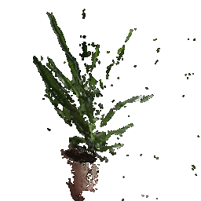
    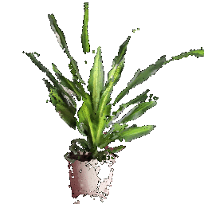
    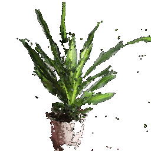
</div>

## 5.2 Parametric Functions (10 + 5 points)


```python {linenos=true}
import pytorch3d as p3d
from starter.utils import get_device
import torch
import numpy as np

def torus_pointcloud(num_samples=200, device=None):
    """
    Renders a torus using parametric sampling. Samples num_samples ** 2 points.
    """

    if device is None:
        device = get_device()

    u = torch.linspace(0, 2 * np.pi, num_samples)
    v = torch.linspace(0, 2 * np.pi, num_samples)
    U, V = torch.meshgrid(u, v)
    R, r = 1.0, 0.4

    x = (R + r * torch.cos(V)) * torch.cos(U)
    y = (R + r * torch.cos(V)) * torch.sin(U)
    z = r * torch.sin(V)

    points = torch.stack((x.flatten(), y.flatten(), z.flatten()), dim=1)
    color = (points - points.min()) / (points.max() - points.min())

    torus_point_cloud = p3d.structures.Pointclouds(
        points=[points], features=[color],
    ).to(device)

    return torus_point_cloud

def trefoil_pointcloud(num_samples=200, device=None):
    """
    Renders a trefoil using parametric sampling. Samples num_samples ** 2 points.
    """

    if device is None:
        device = get_device()

    u = torch.linspace(0, 2 * np.pi, num_samples)
    v = torch.linspace(0, 2 * np.pi, num_samples)

    U, V = torch.meshgrid(u, v)
    R = 0.5

    x = R * torch.sin(3 * U) / (2 + torch.cos(V))
    y = R * (torch.sin(U) + 2 * torch.sin(2 * U)) / (2 + torch.cos(V + np.pi * 2 / 3))
    z = R / 2 * (torch.cos(U) - 2 * torch.cos(2 * U)) * (2 + torch.cos(V)) * (2 + torch.cos(V + np.pi * 2 / 3)) / 4

    points = torch.stack((x.flatten(), y.flatten(), z.flatten()), dim=1)
    color = (points - points.min()) / (points.max() - points.min())

    trefoil_point_cloud = p3d.structures.Pointclouds(
        points=[points], features=[color],
    ).to(device)

    return trefoil_point_cloud

camera_point_360(torus_pointcloud(num_samples=100), elevation=0, duration=2, output_path="output/torus_pointcloud.gif", device='cuda:1')
camera_point_360(trefoil_pointcloud(num_samples=100), elevation=0, duration=2, output_path="output/trefoil_pointcloud.gif", device='cuda:1')
camera_point_360(torus_pointcloud(num_samples=1000), elevation=0, duration=2, output_path="output/torus_pointcloud_1000.gif", device='cuda:1')
camera_point_360(trefoil_pointcloud(num_samples=1000), elevation=0, duration=2, output_path="output/trefoil_pointcloud_1000.gif", device='cuda:1')
camera_point_360(torus_pointcloud(num_samples=5000), elevation=0, duration=2, output_path="output/torus_pointcloud_5000.gif", device='cuda:1')
camera_point_360(trefoil_pointcloud(num_samples=5000), elevation=0, duration=2, output_path="output/trefoil_pointcloud_5000.gif", device='cuda:1')
```

    100%|██████████| 36/36 [00:00<00:00, 39.14it/s]
    100%|██████████| 36/36 [00:00<00:00, 240.69it/s]
    100%|██████████| 36/36 [00:01<00:00, 27.54it/s]
    100%|██████████| 36/36 [00:01<00:00, 23.55it/s]
    100%|██████████| 36/36 [00:30<00:00,  1.19it/s]
    100%|██████████| 36/36 [00:36<00:00,  1.01s/it]


Result:

<div style="display:flex;flex-wrap:wrap;gap:8px;align-items:center;">
    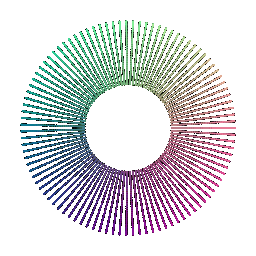
    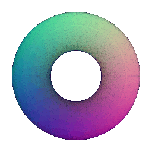
    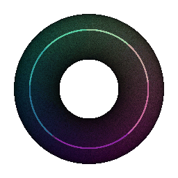
</div>
<div style="display:flex;flex-wrap:wrap;gap:8px;align-items:center;">
    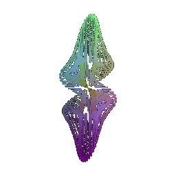
    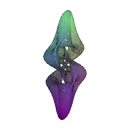
    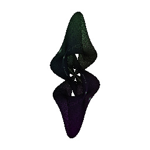
</div>

## 5.3 Implicit Surfaces (15 + 5 points)


```python {linenos=true}
import mcubes
import pytorch3d as p3d

def torus_mesh(voxel_size=64, device=None):
    if device is None:
        device = get_device()
    min_value = -1.1
    max_value = 1.1

    theta = 45.0 / 180.0 * np.pi
    Rot = torch.tensor([ # rot z-axis
        [np.cos(theta), -np.sin(theta), 0.0],
        [np.sin(theta), np.cos(theta), 0.0],
        [0.0, 0.0, 1.0],
    ], dtype=torch.float32)

    X, Y, Z = torch.meshgrid([torch.linspace(min_value, max_value, voxel_size)] * 3)
    X, Y, Z = torch.matmul(Rot[None, None, None, ...], torch.stack([X, Y, Z], dim=-1)[..., None]).squeeze(-1).permute(3, 0, 1, 2)
    R, r = 0.7, 0.3
    voxels = torch.sqrt(torch.square(torch.sqrt(X**2 + Z**2) - R) + Y**2) - r
    vertices, faces = mcubes.marching_cubes(mcubes.smooth(voxels), isovalue=0)
    vertices = torch.tensor(vertices).float()
    faces = torch.tensor(faces.astype(int))
    # Vertex coordinates are indexed by array position, so we need to
    # renormalize the coordinate system.
    vertices = (vertices / voxel_size) * (max_value - min_value) + min_value
    textures = (vertices - vertices.min()) / (vertices.max() - vertices.min())
    textures = p3d.renderer.TexturesVertex(vertices.unsqueeze(0))

    mesh = p3d.structures.Meshes([vertices], [faces], textures=textures).to(device)
    
    return mesh

def ellipsoid_mesh(voxel_size=64, device=None):
    if device is None:
        device = get_device()
    min_value = -1.1
    max_value = 1.1

    theta = 45.0 / 180.0 * np.pi
    Rot = torch.tensor([ # rot z-axis
        [np.cos(theta), -np.sin(theta), 0.0],
        [np.sin(theta), np.cos(theta), 0.0],
        [0.0, 0.0, 1.0],
    ], dtype=torch.float32)

    X, Y, Z = torch.meshgrid([torch.linspace(min_value, max_value, voxel_size)] * 3)
    X, Y, Z = torch.matmul(Rot[None, None, None, ...], torch.stack([X, Y, Z], dim=-1)[..., None]).squeeze(-1).permute(3, 0, 1, 2)
    rx, ry, rz = 1.0, 0.5, 0.75
    k0 = ((X/rx)**2 + (Y/ry)**2 + (Z/rz)**2)
    k1 = ((X/rx**2)**2 + (Y/ry**2)**2 + (Z/rz**2)**2)
    voxels = k0 * (k0 - 1.0) / k1;
    vertices, faces = mcubes.marching_cubes(mcubes.smooth(voxels), isovalue=0)
    vertices = torch.tensor(vertices).float()
    faces = torch.tensor(faces.astype(int))
    # Vertex coordinates are indexed by array position, so we need to
    # renormalize the coordinate system.
    vertices = (vertices / voxel_size) * (max_value - min_value) + min_value
    textures = (vertices - vertices.min()) / (vertices.max() - vertices.min())
    textures = p3d.renderer.TexturesVertex(vertices.unsqueeze(0))

    mesh = p3d.structures.Meshes([vertices], [faces], textures=textures).to(device)
    
    return mesh

camera360(torus_mesh(), elevation=30, duration=2, output_path="output/torus_mesh.gif")
camera360(ellipsoid_mesh(), elevation=30, duration=2, output_path="output/ellipsoid_mesh.gif")
```

    100%|██████████| 36/36 [00:00<00:00, 136.40it/s]
    100%|██████████| 36/36 [00:00<00:00, 147.21it/s]


Results:

<div style="display:flex;flex-wrap:wrap;gap:8px;align-items:center;">
    
    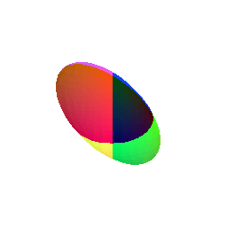
</div>

# 6. Do Something Fun (10 points)

"Oiiaioooooiai Cat!!!!!" (https://skfb.ly/pyYNA) by baby_saja is licensed under Creative Commons Attribution (http://creativecommons.org/licenses/by/4.0/).


```python {linenos=true}
from pytorch3d.io.experimental_gltf_io import load_meshes as gltf_load_meshes
from pytorch3d.io import IO

io = IO()
data = gltf_load_meshes("data/oiiaioooooiai-cat/source/oiiaioooooiai_cat.glb", io.path_manager)

camera360(data[0][1], img_size=512, num_frames=36, distance=0.9, elevation=25, output_path="output/oiia_cat.gif")
```

    100%|██████████| 36/36 [00:00<00:00, 74.60it/s]


Result:

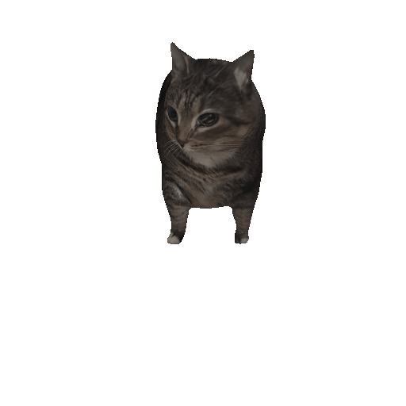

# (Extra Credit) 7. Sampling Points on Meshes (10 points)


```python {linenos=true}
import numpy as np
import torch
import torch.nn.functional as F

def sample_barycentric(n, mode="uniform"):
    if mode == "uniform":
        a = np.random.rand(n, 1)
        a1 = 1 - np.sqrt(a)
        a2 = np.random.rand(n, 1)
        return np.stack((a1, (1 - a1) * a2, (1 - a1) * (1 - a2)), axis=-1)
    elif mode == "bias":
        a1 = np.random.rand(n, 1)
        a2 = np.random.rand(n, 1) * (1 - a1)
        a3 = 1 - a1 - a2
        return np.stack((a1, a2, a3), axis=-1)
    else:
        raise Exception("Invalid mode")

def sample_points_on_triangle(triangle, num_points, mode="uniform"):
    barycentric = sample_barycentric(num_points, mode)
    return np.matmul(barycentric, triangle)

def sample_points_on_mesh(mesh, num_points, face_mode="uniform", bary_mode="uniform"):
    verts = mesh.verts_packed().to(torch.float64)
    faces = mesh.faces_packed()
    faces_areas = mesh.faces_areas_packed().to(torch.float64)
    textures = mesh.textures
    uvs_map = textures.maps_padded().permute(0, 3, 1, 2) # (B, C, H, W)
    verts_uvs = textures.verts_uvs_padded().squeeze(0).to(torch.float64)
    faces_uvs = textures.faces_uvs_padded().squeeze(0)

    if face_mode == "uniform":
        sample_indices = np.random.choice(faces.shape[0], size=num_points, p=faces_areas/faces_areas.sum())
    elif face_mode == "bias":
        sample_indices = np.random.choice(faces.shape[0], size=num_points)
    else:
        raise Exception("Invalid face mode")
    
    sample_faces = faces[sample_indices]
    sample_triangles = verts[sample_faces]
    sample_faces_uvs = faces_uvs[sample_indices]
    sample_triangles_uvs = verts_uvs[sample_faces_uvs]
    sample_barycentric_coords = torch.from_numpy(sample_barycentric(num_points, bary_mode))
    sample_points = torch.matmul(sample_barycentric_coords, sample_triangles).to(torch.float32).squeeze(1)
    sample_points_uvs = torch.matmul(sample_barycentric_coords, sample_triangles_uvs).to(torch.float32).squeeze(1)

    u = sample_points_uvs[..., 0]
    v = 1.0 - sample_points_uvs[..., 1]
    grid = torch.stack([u, v], dim=-1) 
    grid = grid * 2.0 - 1.0
    grid = grid[None, None, :, :]

    sample_points_colors = F.grid_sample(
        uvs_map, grid,
        mode="bilinear",
        padding_mode=textures.padding_mode,
        align_corners=textures.align_corners,
    ).squeeze(2).squeeze(0).permute(1, 0)

    return sample_points, sample_points_colors
```


```python {linenos=true}
import matplotlib.pyplot as plt

triangle = np.array([[
    [1, 4],
    [4, 5],
    [10, 4],
]])
num_points = 10000
fig, axes = plt.subplots(1, 2, figsize=(10, 4))
uniform_points = sample_points_on_triangle(triangle, num_points, "uniform")
bias_points = sample_points_on_triangle(triangle, num_points, "bias")
axes[0].set_title("Uniform sampling")
axes[0].scatter(triangle[0, :, 0], triangle[0, :, 1], c='red')
axes[0].scatter(uniform_points[:, 0, 0], uniform_points[:, 0, 1], c='blue', s=0.1)
axes[1].set_title("Bias sampling")
axes[1].scatter(triangle[0, :, 0], triangle[0, :, 1], c='red')
axes[1].scatter(bias_points[:, 0, 0], bias_points[:, 0, 1], c='blue', s=0.1)
plt.show()
```


    
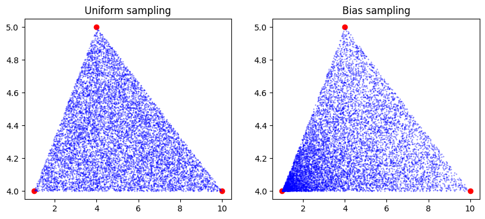
    


```python {linenos=true}
from pytorch3d.io import load_objs_as_meshes
from pytorch3d.structures import Pointclouds
from pytorch3d.vis.plotly_vis import plot_scene, plot_batch_individually

cow_mesh = load_objs_as_meshes(["data/cow.obj"])

face_mode = ["uniform", "bias"]
bary_mode = ["uniform", "bias"]

for fm in face_mode:
    for bm in bary_mode:
        sample_points, sample_points_colors = sample_points_on_mesh(cow_mesh, 10**5, fm, bm)
        sample_pointcloud = Pointclouds(
            points=[sample_points],
            features=[sample_points_colors],
        )
        camera_point_360(sample_pointcloud, img_size=1024, duration=10000, output_path=f"output/cow_sampled_pointcloud_{fm}_{bm}.gif", device='cuda:1')
```

     11%|█         | 4/36 [00:00<00:01, 16.23it/s]

    100%|██████████| 36/36 [00:01<00:00, 19.01it/s]
    100%|██████████| 36/36 [00:01<00:00, 18.42it/s]
    100%|██████████| 36/36 [00:01<00:00, 18.06it/s]
    100%|██████████| 36/36 [00:01<00:00, 19.17it/s]


Result of sampling 1000 points from the cow mesh with different combinations of area and angle based sampling:

Uniform face sampling and uniform barycentric coordinate sampling:

<!-- <div align="center"> -->
  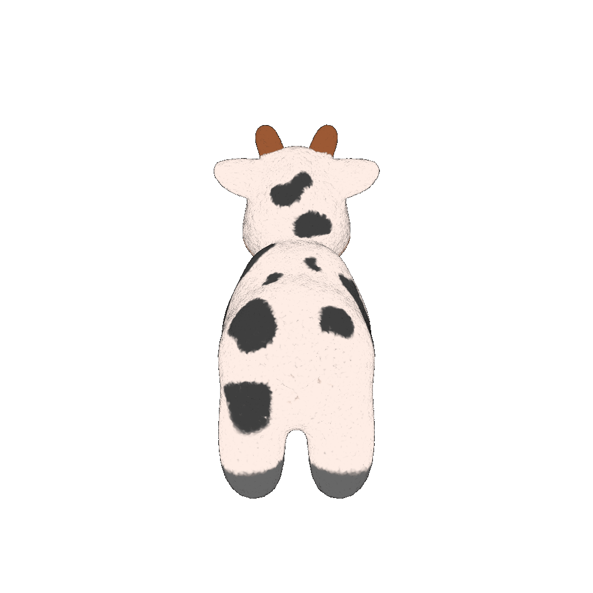
<!-- </div> -->

Uniform face sampling and biased barycentric coordinate sampling:

<!-- <div align="center"> -->
  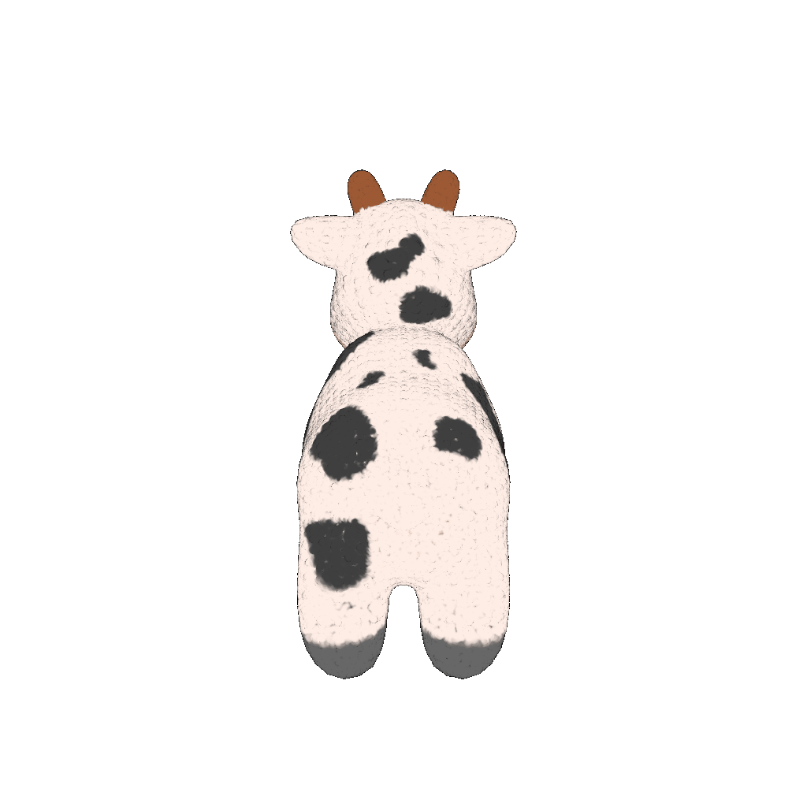
<!-- </div> -->

Biased face sampling and uniform barycentric coordinate sampling:

<!-- <div align="center"> -->
  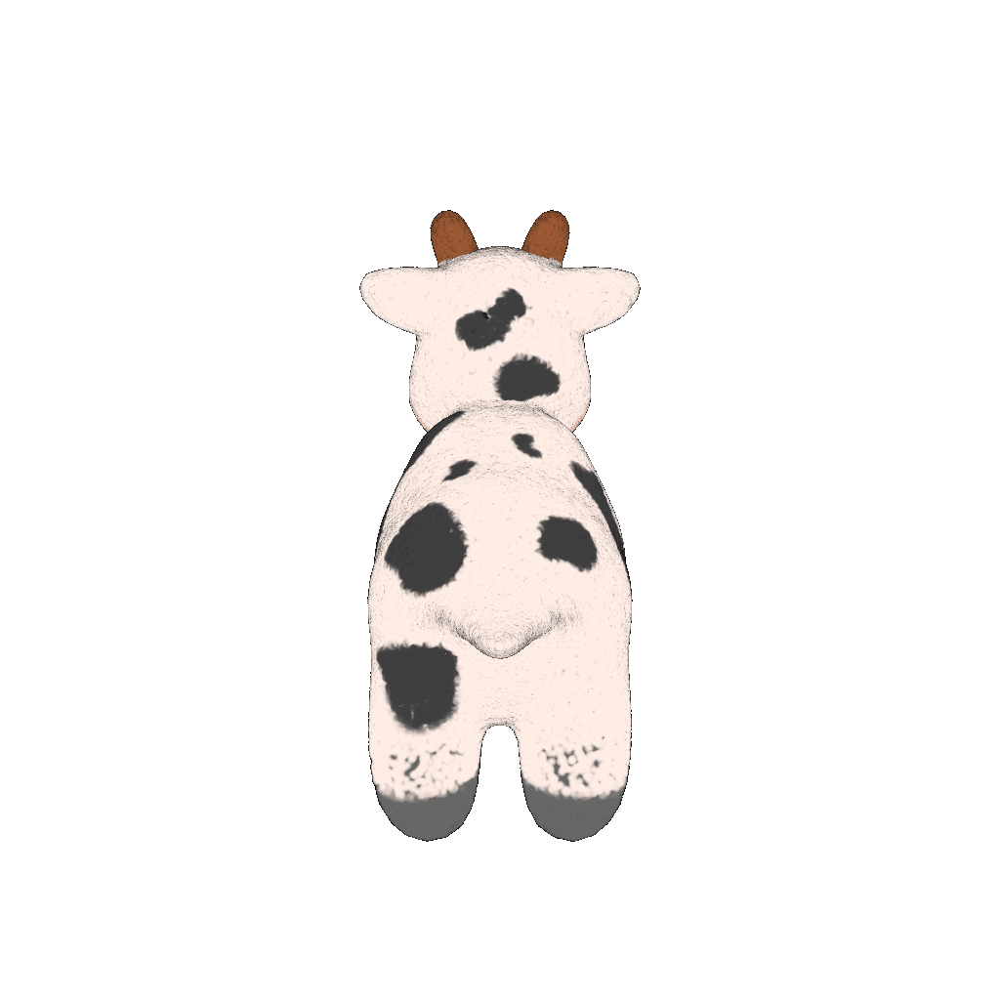
<!-- </div> -->

Biased face sampling and biased barycentric coordinate sampling:

<!-- <div align="center"> -->
  
<!-- </div> -->

